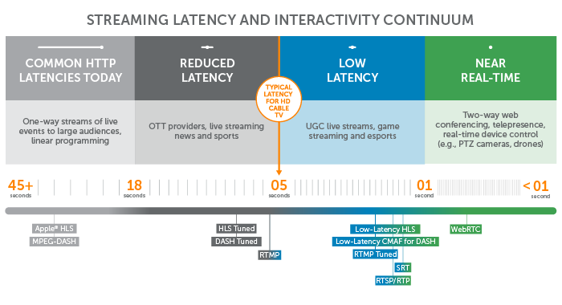

# Streaming protocols

> Per una trattazione più approfondita, consultare le [dispense](https://classroom.google.com/c/NjIzODMzMzc0NjU3/m/NjkzNTIyNTgxNjE4/details) di Santo Dell'Omo sull'argomento (accesso richiesto).

| Protocol Name | Developed By | Key Differences|
|---------------|--------------|----------------|
| **RTMP**   (Real-Time Messaging Protocol)      | Macromedia/ Adobe        | **Latency:** Low (around 2 seconds).  **Technology:** TCP-based, maintains a persistent connection.  **Usage:** Primarily used for live streaming to platforms.  **Compatibility:** Broad support in streaming software, limited native support in browsers.                                                                                      |
| **HLS**   (HTTP Live Streaming)      | Apple        | **Latency:** Higher (10-30 seconds).  **Technology:** HTTP-based, breaks stream into small segments.  **Usage:** Used for both live and on-demand streaming, especially on Apple devices.  **Compatibility:** Wide support across iOS devices and browsers that support HTML5.                                                                         |
| **IPTV**   (Internet Protocol Television)      | Various      | **Latency:** Varies, generally low for live TV.  **Technology:** IP-based, often uses multicast for live TV and unicast for video on demand.  **Usage:** Used for delivering TV services over IP networks, often by telecom providers.  **Compatibility:** Requires specific set-top boxes or apps provided by the service provider. |

## Examples

RTMP:
- **YouTube Live:** RTMP is used to send the live stream from the broadcaster's encoder to YouTube's servers.
- **Twitch:** Streamers use RTMP to broadcast live gameplay to Twitch's servers.
  
HLS:
- **Apple TV:** Uses HLS to stream video content to Apple devices.
- **Netflix:** Employs HLS for adaptive streaming to ensure smooth playback regardless of network conditions.

IPTV:
- **Verizon Fios TV:** Uses IPTV technology to deliver television services to customers.
- **AT&T U-verse:** Another example of a telecom operator using IPTV for delivering TV channels and on-demand content.

## Latency and interactivity

